# 🏦 BankApp Authentication Service

> Modern, secure passwordless authentication microservice built with Spring Boot and Hexagonal Architecture

[](https://spring.io/projects/spring-boot)
[](https://openjdk.org/)
[](https://webauthn.guide/)
[](https://www.postgresql.org/)
[](https://redis.io/)
[](https://www.rabbitmq.com/)

## 🌐 Live Demo

**Try it out:** [https://auth.bankapp.online/](https://auth.bankapp.online/)

Experience passwordless authentication with WebAuthn/FIDO2 using your device's biometrics or hardware security keys.

> **Note:** Works on desktop (Windows, macOS, Linux) and Android devices. iPhone compatibility issue currently under
> investigation.

---

## 📖 Overview

BankApp Auth is a production-ready authentication microservice that demonstrates modern security practices and clean
architecture principles. It provides **passwordless authentication** using WebAuthn/FIDO2 standards, eliminating
traditional password vulnerabilities while delivering a seamless user experience.

**Core Capabilities:**

- 📧 **Email-based verification** with secure OTP delivery
- 🔐 **Passwordless authentication** via WebAuthn/FIDO2
- 📱 **Multi-device support** - biometrics, security keys, and platform authenticators
- 🔔 **Event-driven architecture** with asynchronous messaging
- 🎫 **Token issuance interface** ready for JWT implementation

---

## ✨ Key Features & Technical Highlights

### Architecture & Design

- **Hexagonal Architecture (Ports & Adapters)** - Clean separation between business logic and infrastructure, enabling
  high testability and technology independence
- **Domain-Driven Design** - Value objects, aggregates, and use cases that model the authentication domain
- **Event-driven communication** - RabbitMQ-based async messaging for scalability

### Security Implementation

- **WebAuthn/FIDO2 Compliance** - Industry-standard passwordless authentication with public key cryptography
- **Industry-standard BCrypt password hashing** via Spring Security
- **Defense in depth** - Input validation, CORS policies, and comprehensive security headers
- **Authorization token port** - Clean abstraction ready for OAuth2/JWT authorization implementation

### Modern Tech Stack

- **Virtual Threads (Java 21+)** - High-concurrency request handling with minimal resource overhead
- **Redis-based session management** - Fast, distributed session storage with TTL expiration
- **PostgreSQL + Flyway** - Versioned database migrations and ACID compliance
- **12-Factor App Design** - Cloud-native principles with externalized configuration and stateless processes
- **Docker Compose orchestration** - Multi-container deployment with infrastructure as code

---

## 🏗️ Architecture

Built with **Hexagonal Architecture** (Ports & Adapters) for maintainability and testability.

**Benefits:**

- 🧪 **High testability** - Business logic tested without infrastructure dependencies
- 🔄 **Technology independence** - Swap databases or frameworks without touching core logic
- 📦 **Clear boundaries** - Explicit separation between layers prevents coupling

---

## 📊 Authentication Flows

```mermaid
flowchart LR
    A[New User] --> B[Email Verification]
    B --> C[WebAuthn Registration]
    C --> D[✅ Authenticated]

E[Existing User] --> F[WebAuthn Login]
F --> G[✅ Authenticated]
```



**Supported Flows:**

1. **New User Registration**: Email Verification → WebAuthn Registration → Authorization Token Issuance
2. **Existing User Login**: WebAuthn Authentication → Authorization Token Issuance
3. **Alternative Flow**: Email Verification → WebAuthn Authentication

---

## 🐳 Quick Start

### Prerequisites

- Docker & Docker Compose
- Git
- **External notification service** (see [Notification Integration Guide](../../wiki/Notification-Integration))

### Running Locally

1. **Clone the repository**
   ```bash
   git clone <repository-url>
   cd bankapp-auth
   ```

2. **Start all services**
   ```bash
   docker compose up -d
   ```

3. **Access the application**
    - API: `http://localhost:8080`
    - PostgreSQL: `localhost:5432`
    - Redis: `localhost:6379`
    - RabbitMQ Management: `http://localhost:15672`

4. **Health check**
   ```bash
   curl http://localhost:8080/actuator/health
   ```

> **Note:** This service publishes OTP events to RabbitMQ. You'll need to implement or run a notification service to
> consume these events and deliver emails. See
> the [Notification Integration Guide](../../wiki/Notification-Integration) for RabbitMQ queue details and message
> schemas.

**Optional: Using the example notification service**

```bash
# Uncomment notification service in docker-compose.yml
cd docker
cp .env.notification-service.example .env.notification-service
# Edit with your Resend credentials
```

**Configuration:**
For detailed environment variables and production configuration, see
the [Wiki Configuration Guide](../../wiki/Configuration).

---

## 📝 API Documentation

### Interactive API Explorer

**[🔗 Live Swagger Documentation](https://auth.bankapp.online/api)**

Explore the complete API specification with interactive request/response examples, schema definitions, and the ability
to test endpoints directly in your browser.

### Quick Reference

| Endpoint                       | Method | Description                                             |
|--------------------------------|--------|---------------------------------------------------------|
| `/api/verification/initiate`   | POST   | Start email verification with OTP                       |
| `/api/verification/complete`   | POST   | Validate OTP and create session                         |
| `/api/authentication/initiate` | GET    | Begin WebAuthn authentication                           |
| `/api/authentication/complete` | POST   | Complete WebAuthn and get authorization tokens          |
| `/api/registration/complete`   | POST   | Finalize user registration and get authorization tokens |

For detailed request/response schemas, authentication requirements, and example payloads, visit
the [Swagger UI](https://auth.bankapp.online/api).

---

## ⚠️ Project Status & Limitations

### Current Status

✅ **Production-ready** for demonstration and portfolio purposes  
✅ **Live deployment** available at [auth.bankapp.online](https://auth.bankapp.online/)  
✅ **Core functionality** complete and tested

### Planned Enhancements

- 🔧 **JWT authorization tokens** - Production implementation of `TokenIssuingPort` for OAuth2/JWT token generation
    - Architectural decision: Monolithic (within service) vs Microservice (separate authorization server)
    - Port-based design allows either approach without breaking changes

### Known Issues

#### iPhone Compatibility

- **Issue:** WebAuthn flow not functioning correctly on iOS devices (Safari)
- **Status:** Under investigation - may be frontend implementation or data format incompatibility
- **Workaround:** Use desktop (Windows, macOS, Linux) or Android devices

### Production Hardening Checklist

If deploying this service in a production environment, implement the following enhancements:

#### 1. WebAuthn Credential Management

Current implementation uses a simplified approach. For production:

- **Add `allowCredentials` list** to `PublicKeyCredentialRequestOptions`
    - Include user's registered credential IDs for better UX and security

- **Update `Session` object** in `CompleteVerificationUseCase`
    - Store user's credential data in session for authentication ceremony

- **Modify `InitiateAuthenticationUseCase`**
    - Fetch user data and associated credentials from database
    - Populate session with credential list

> 💡 The `Session` DTO already includes a `credentialId: List<UUID>` field to support this functionality.

#### 2. Strict WebAuthn Configuration

Current setup uses `createNonStrictWebAuthnRegistrationManager()` for development ease.

**Production requires:**

- Configure strict `WebAuthnRegistrationManager` with:
    - Attestation statement verifiers
    - Certificate path validators
    - Trust anchor configuration
    - Full certificate chain validation

#### 3. Additional Security Hardening

- [ ] Rate limiting on authentication endpoints
- [ ] Advanced monitoring and alerting
- [ ] Audit logging for security events
- [ ] Regular security dependency updates
- [ ] Penetration testing

---

## 🔐 Security Considerations

### Authentication Security

- **WebAuthn FIDO2** - Phishing-resistant, public key cryptography
- **Secure OTP generation** - Cryptographically secure random number generation
- **BCrypt password hashing** - Spring Security standard implementation

### Authorization Token Security

- **Authorization token abstraction** - Port-based design ready for OAuth2/JWT authorization implementation
- **Security considerations** - Architecture supports RSA-signed JWTs, short-lived access tokens, and refresh token
  rotation

### Infrastructure Security

- **Input validation** - Comprehensive sanitization of all inputs
- **CORS policies** - Configured for production domain restrictions
- **Secure session management** - Redis-based with TTL expiration

---

## 📚 Documentation

For comprehensive technical documentation, visit our wiki:

- **[📖 Wiki Home](../../wiki/Home)** - Service overview and getting started
- **[🔧 Implementation Details](../../wiki/Implementation-Details)** - Architecture deep dive
- **[📋 Use Cases](../../wiki/)** - Detailed use case documentation
- **[⚙️ Configuration Guide](../../wiki/Configuration)** - Environment and deployment setup
- **[🔌 API Documentation](https://auth.bankapp.online/api)** - Interactive Swagger UI with complete endpoint
  specifications
- **[📧 Notification Integration](../../wiki/Notification-Integration)** - RabbitMQ messaging and external
  notification service setup

### Development Guidelines

#### Use Case Pattern
```java
@UseCase  // Always annotate use case classes
public class InitiateVerificationUseCase {
    // Pure business logic - no framework dependencies
}
```

#### Dependency Injection
```java
@RequiredArgsConstructor  // Preferred over @Autowired
public class VerificationController {
    private final InitiateVerificationUseCase initiateVerificationUseCase;
}
```

#### Value Objects
```java
// Always use domain VOs for type safety
EmailAddress email = EmailAddress.of("user@example.com");
```

---

## 🛠️ Tech Stack

### Core Framework

- **Spring Boot 3.5** - Latest stable release with autoconfiguration
- **Java 21** - Virtual threads for high-concurrency workloads
- **Maven 3.9+** - Dependency management and build tool

### Persistence & Caching

- **PostgreSQL 15+** - Primary data store with ACID guarantees
- **Spring Data JPA** - ORM with repository pattern
- **Flyway** - Database migration versioning
- **Redis 7+** - Distributed session cache with TTL

### Security & Authentication

- **Spring Security** - Comprehensive security framework
- **WebAuthn4J** - FIDO2/WebAuthn implementation library
- **Token Issuance Port** - Ready for OAuth2/JWT integration

### Messaging & Integration

- **RabbitMQ** - AMQP message broker for async events
- **Spring AMQP** - RabbitMQ integration

### DevOps & Deployment

- **Docker** - Containerization
- **Docker Compose** - Multi-container orchestration
- **Spring Boot Actuator** - Health checks and metrics

---

## 🤝 Contributing

Contributions are welcome! This project is open for collaboration.

1. Fork the repository
2. Create a feature branch (`git checkout -b feature/amazing-feature`)
3. Follow the development guidelines above
4. Add tests for new functionality
5. Submit a pull request

---

## 📄 License

This project is licensed under the MIT License - see the LICENSE file for details.

---

## 🔗 Related Projects

- **[Notification Service](https://github.com/BankApp-project/notification-service)** -
  See [Notification Integration Guide](../../wiki/Notification-Integration) for implementation details
- **[BankApp Frontend](https://github.com/BankApp-project/bankapp-auth-frontend)** - Vanilla JavaScript user interface

---

**Questions?** Check the [Wiki](../../wiki/Home) or open an issue!