# 🏦 BankApp Authentication Service

> Modern, secure passwordless authentication microservice built with Spring Boot and Hexagonal Architecture

[](https://spring.io/projects/spring-boot)
[](https://openjdk.org/)
[](https://webauthn.guide/)

## 🌐 Live Demo

**[Try it out →](https://auth.bankapp.online/)**

Experience passwordless authentication with WebAuthn/FIDO2 using your device's biometrics or hardware security keys.

> **Note:** Currently supports desktop (Windows, macOS, Linux) and Android. iOS compatibility under investigation.

---

## 📖 What is BankApp Auth?

A production-ready authentication microservice demonstrating modern security practices and clean architecture. Features **passwordless authentication** using WebAuthn/FIDO2, eliminating traditional password vulnerabilities.

**Key capabilities:**
- 📧 Email-based verification with secure OTP
- 🔐 Passwordless authentication via WebAuthn/FIDO2
- 📱 Multi-device support (biometrics, security keys)
- 🔔 Event-driven architecture with async messaging
- 🎫 Authorization token interface ready for JWT

### Authentication Flows

```mermaid
flowchart TD
    Start([User Starts]) --> Choice{Device known by system?}
    
    %% New User Registration Flow
    Choice -->|New User| IV[Initiate Verification]
    IV --> CV[Complete Verification]
    CV --> CR[Complete Registration]
    CR --> Success1[✅ Registered & Authenticated]
    
    %% Existing User Authentication Flow
    Choice -->|Existing User| IA[Initiate Authentication]
    IA --> CA[Complete Authentication]
    CA --> Success2[✅ Authenticated]
    
    %% Alternative Flow: Verification then Authentication
    CV -->|User Already Has Passkey| CA3[Complete Authentication]
    CA3 --> Success3[✅ Authenticated]
    
    %% Styling
    classDef useCase fill:#e1f5fe,stroke:#01579b,stroke-width:2px
    classDef success fill:#e8f5e8,stroke:#2e7d32,stroke-width:2px
    classDef decision fill:#fff3e0,stroke:#ef6c00,stroke-width:2px
    
    class IV,CV,IA,CA,CR,CA3 useCase
    class Success1,Success2,Success3 success
    class Choice decision
```



**Supported flows:**
1. **New User Registration**: Email Verification → WebAuthn Registration → Authorization Token Issuance
2. **Existing User Login**: WebAuthn Authentication → Authorization Token Issuance
3. **Alternative Flow**: Email Verification → WebAuthn Authentication

**Built with:**
- Hexagonal Architecture for clean separation and testability
- Domain-Driven Design principles
- Spring Boot 3.5 with Virtual Threads (Java 21+)
- PostgreSQL, Redis, RabbitMQ

---

## 🚀 Quick Start

### Prerequisites

- **Docker** with Compose support
- **Git**
- **Available ports**: 8080, 5432, 6379, 5672, 15672

> Port conflicts? Customize them in `compose.yml` and `docker/.env.docker`

### Installation

**1. Clone and navigate to the repository**
```bash
git clone https://github.com/BankApp-project/auth.git
cd auth
```

**2. Start all services**
```bash
docker compose up -d
```

This starts the Auth Service, PostgreSQL, Redis, and RabbitMQ with automatic schema migration.

**3. Verify the service**
```bash
curl http://localhost:8080/actuator/health
# Expected: {"status":"UP"}
```

### Access Points

| Service                 | URL                       | Credentials       |
|-------------------------|---------------------------|-------------------|
| **API Documentation**   | http://localhost:8080/api | -                 |
| **API Base**            | http://localhost:8080/api | -                 |
| **RabbitMQ Management** | http://localhost:15672    | `guest` / `guest` |

### Testing Options

**Quick API Test (cURL):**
```bash
curl -X POST http://localhost:8080/api/v1/auth/verification/initiate \
  -H "Content-Type: application/json" \
  -d '{"email": "test@example.com"}'
```

**Complete Authentication Flow (Recommended):**

To test the full user experience with WebAuthn/FIDO2, use the BankApp frontend application:

👉 **[BankApp Auth Frontend](https://github.com/BankApp-project/bankapp-auth-frontend)**

The frontend provides a complete UI for testing registration and authentication flows with your local backend.

### Email Setup (Important!)

**This service publishes OTP events but doesn't send emails directly.**

**For local testing**, enable console logging in `docker/.env.docker`:
```properties
APP_OTP_CONSOLE_ENABLED=true
```

Then view OTP codes in logs:
```bash
docker compose logs -f auth-service
```

**For production**, integrate
the [BankApp Notification Service](https://github.com/BankApp-project/auth/wiki/Notification-Integration) or implement
your own consumer.

### Troubleshooting

**Port conflicts?** Change port mappings in `compose.yml`:
```yaml
services:
  auth-service:
    ports:
      - "8081:8080"  # Changed from 8080 to 8081
```

Then restart:
```bash
docker compose down && docker compose up -d
```

---

📖 **Need more details?** Check the [full documentation](https://github.com/BankApp-project/auth/wiki)

## 📚 Documentation

- **[📖 Full Documentation](https://github.com/BankApp-project/auth/wiki)** - Complete technical documentation
- **[🔌 API Reference](https://auth.bankapp.online/api)** - Interactive Swagger UI
- **[⚙️ Configuration](https://github.com/BankApp-project/auth/wiki/Configuration)** - Environment setup and deployment
- **[📧 Notification Integration](https://github.com/BankApp-project/auth/wiki/Notification-Integration)** - External service setup

---

## ⚠️ Project Status

**Current:** Production-ready for demonstration purposes with live deployment

**Known limitations:**
- iOS/iPhone WebAuthn compatibility issue under investigation
- JWT token implementation pending (port-based design ready)
- Simplified WebAuthn setup (use strict mode for production)

See [Project Status & Limitations](https://github.com/BankApp-project/auth/wiki#%EF%B8%8F-project-status) in the wiki for production hardening checklist.

---

## 🛠️ Tech Stack

**Core:** Spring Boot 3.5, Java 21, Maven  
**Data:** PostgreSQL, Redis, Spring Data JPA, Flyway  
**Security:** Spring Security, WebAuthn4J  
**Messaging:** RabbitMQ, Spring AMQP  
**DevOps:** Docker, Docker Compose

---

## 🤝 Contributing

Contributions welcome! Please:
1. Fork the repository
2. Create a feature branch
3. Follow existing architecture patterns
4. Add tests for new functionality
5. Submit a pull request

See the [Wiki](https://github.com/BankApp-project/auth/wiki) for development guidelines.

---

## 📄 License

MIT License - see LICENSE file for details.

---

## 🔗 Related Projects

- [Notification Service](https://github.com/BankApp-project/notification-service)
- [BankApp Frontend](https://github.com/BankApp-project/bankapp-auth-frontend)

---

**Questions?** Check the [Wiki](https://github.com/BankApp-project/auth/wiki) or open an issue.
