# 🏦 BankApp Authentication Service

> Modern, secure WebAuthn-based authentication microservice built with Spring Boot 4 and Hexagonal Architecture.

[](https://spring.io/projects/spring-boot)
[](https://openjdk.org/)
[](https://webauthn.guide/)
[](https://www.postgresql.org/)
[](https://redis.io/)

## 🚀 Quick Start

### Prerequisites

- Java 25
- Maven 3.9/4.0+
- PostgreSQL 15+
- Redis 7+
- Docker & Docker Compose (optional)

### 🐳 Docker Quick Start

//placeholder

## 🎯 What Does This Service Do?

BankApp Auth provides **passwordless authentication** using modern WebAuthn/FIDO2 standards:

- 📧 **Email Verification**: OTP-based user verification
- 🔐 **WebAuthn Authentication**: Biometric and hardware key support
- 📱 **Multi-Device Support**: Smartphone, desktop, and hardware authenticators
- 🎫 **JWT Token Management**: Secure token issuance and validation
- 🔔 **Event-Driven Notifications**: Asynchronous messaging via RabbitMQ

## 📊 Authentication Flows

```mermaid
flowchart LR
    A[New User] --> B[Email Verification]
    B --> C[WebAuthn Registration]
    C --> D[✅ Authenticated]

E[Existing User] --> F[WebAuthn Login]
F --> G[✅ Authenticated]
```



**Supported Flows:**
- `Email Verification → WebAuthn Registration` (New Users)
- `WebAuthn Authentication` (Existing Users)
- `Email Verification → WebAuthn Authentication` (Alternative)

## 🏗️ Architecture

Built with **Hexagonal Architecture** (Ports & Adapters):
- **Clean separation** between business logic and infrastructure
- **Technology independence** - easily swap databases or frameworks
- **High testability** with mocked adapters and pure domain logic

### Tech Stack
- **Framework**: Spring Boot 4 with Virtual Threads
- **Database**: PostgreSQL + Spring Data JPA
- **Database versioning**: Flyway
- **Cache**: Redis with TTL-based session management
- **Messaging**: RabbitMQ (AMQP)
- **Authentication**: WebAuthn4J (FIDO2)
- **Authorization**: Spring OAuth2 Authorization Server

## 🛠️ Configuration

### Required Environment Variables

//placeholder

### RSA Key Configuration

//placeholder

## 📝 API Endpoints

| Endpoint                       | Method | Description                               |
|--------------------------------|--------|-------------------------------------------|
| `/api/verification/initiate`   | POST   | Start email verification with OTP         |
| `/api/verification/complete`   | POST   | Validate OTP and create session           |
| `/api/authentication/initiate` | GET    | Begin WebAuthn authentication             |
| `/api/authentication/complete` | POST   | Complete WebAuthn and get tokens          |
| `/api/registration/complete`   | POST   | Finalize user registration and get tokens |

## 🧪 Testing

//placeholder

## 📚 Documentation

For detailed technical documentation:

- **[📖 Wiki Home](wiki/Home.md)** - Comprehensive service overview
- **[🔧 Implementation Details](wiki/Implementation-Details.md)** - Architecture deep dive
- **[📋 Use Cases](wiki/)** - Detailed use case documentation

### Development Guidelines

#### Use Case Implementation
```java
@UseCase  // Always annotate use case classes
public class InitiateVerificationUseCase {
    // Implementation
}
```

#### Dependency Injection
```java
@RequiredArgsConstructor  // Preferred over @Autowired
public class VerificationController {
    private final InitiateVerificationUseCase initiateVerificationUseCase;
}
```

#### Email Handling
```java
// Always use EmailAddress VO for type safety
EmailAddress email = EmailAddress.of("user@example.com");
```

## 🔐 Security Considerations

### Development vs Production

**⚠️ Current Setup (Development)**
- Uses `WebAuthnRegistrationManager.createNonStrictWebAuthnRegistrationManager()`
- Bypasses attestation verification for easier development

**🛡️ Production Requirements**
- Configure strict `WebAuthnRegistrationManager` with:
    - Attestation statement verifiers
    - Certificate path validators
    - Trust anchor configuration
    - Certificate chain validation

### Security Features
- **WebAuthn FIDO2 Compliance**: Industry-standard passwordless authentication
- **Secure OTP Generation**: Cryptographically secure random numbers
- **BCrypt Password Hashing**: Industry-standard hashing algorithm
- **JWT Security**: RSA-signed tokens with proper expiration
- **OAuth2 Authorization Server**: Spring Security integration for token validation
- **Input Validation**: Comprehensive request sanitization

## 🔧 Troubleshooting

### Login Issues for Registered Users

**Problem**: Users may experience UX difficulties when attempting to log in after registration.

**Solution**: If login issues occur, implement credential-based authentication by:

1. **Add `allowCredentials` list** to `PublicKeyCredentialRequestOptions` containing the user's registered credentials
2. **Update `Session` object** in `CompleteVerificationUseCase` to include the user's credential data
3. **Modify `InitiateAuthenticationUseCase`** to:
    - Fetch user data and their associated credential list
    - Pass this information to the `Session` object

**Implementation Notes**:

- The `Session` DTO already contains a `credentialId` field of type `List<UUID>` to support this functionality
- This approach ensures WebAuthn ceremonies can reference specific user credentials, improving authentication
  reliability

## 🤝 Contributing

1. Fork the repository
2. Create a feature branch (`git checkout -b feature/amazing-feature`)
3. Follow the coding guidelines in this README
4. Add tests for new functionality
5. Submit a pull request

## 📄 License

This project is under MIT license.

## 🔗 Related Projects

- **BankApp Gateway** - API gateway and routing
- **BankApp Notification** - Notification service

---

*Need help? Check our [Wiki](wiki/Home.md) or open an issue!*