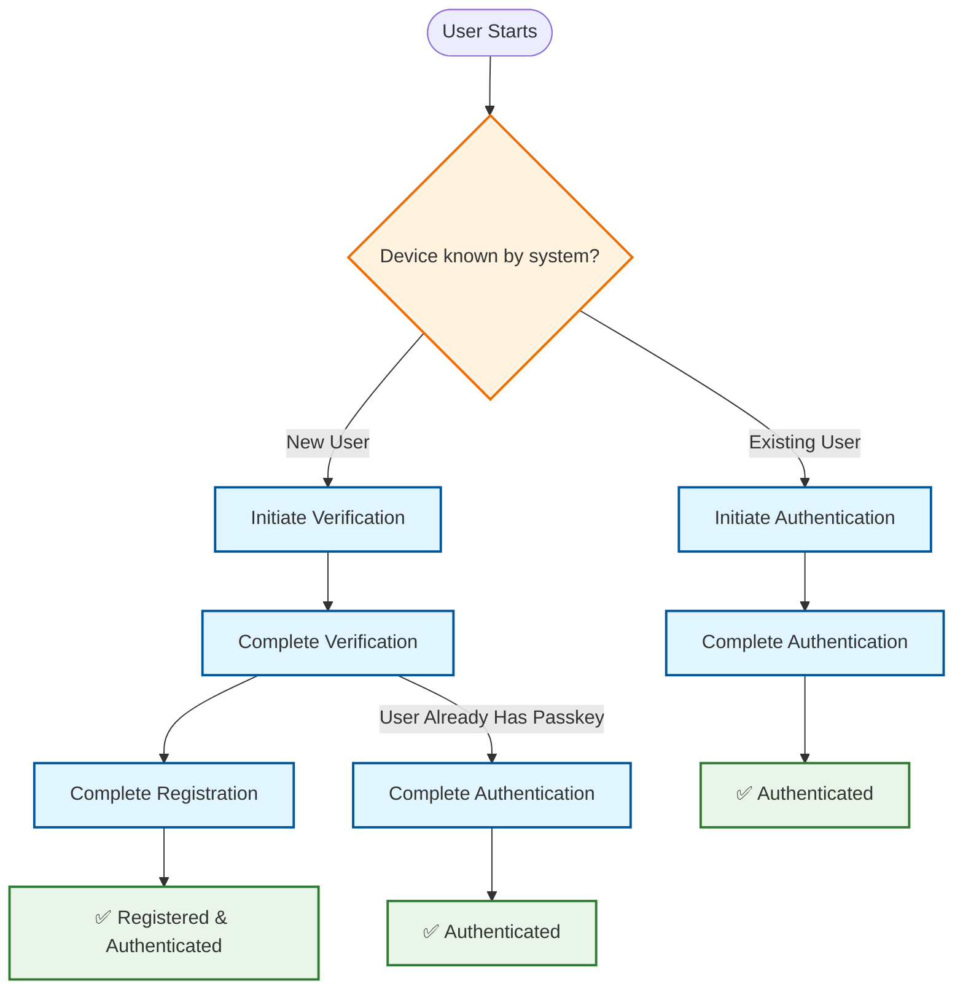
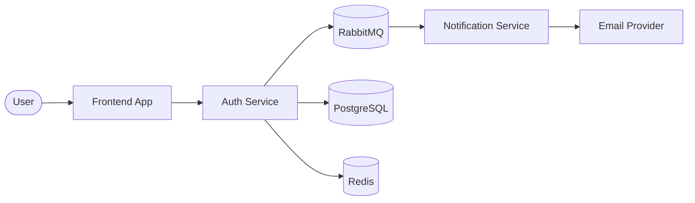

# BankApp Authentication Service - Wiki

Welcome to the comprehensive documentation for the **BankApp Authentication Service**, a modern, secure, and scalable
authentication microservice built with Spring Boot 3.5 and designed around **Hexagonal Architecture** principles.

## 🌐 Live Demo

**Try it out:** [https://auth.bankapp.online/](https://auth.bankapp.online/)

Experience passwordless authentication with WebAuthn/FIDO2 using your device's biometrics or hardware security keys.

> **Note:** Works on desktop (Windows, macOS, Linux) and Android devices. iPhone compatibility issue currently under
> investigation.

## 🏛️ What is BankApp Auth?

BankApp Auth is a production-ready authentication microservice that provides:

- **WebAuthn/Passkey Authentication**: Modern passwordless authentication using FIDO2 standards
- **OTP-based Email Verification**: Secure one-time password verification for user registration
- **JWT Token Management**: Secure token issuance and validation for downstream services
- **Event-Driven Architecture**: Asynchronous notifications via RabbitMQ

## 🏗️ Architecture Overview

This service implements **Hexagonal Architecture (Ports and Adapters)** pattern, ensuring:

- **Clean separation** between business logic and infrastructure concerns
- **Technology independence** - easily swap databases, message brokers, or external services
- **Testability** - pure domain logic with clear boundaries
- **Maintainability** - organized codebase following DDD principles

### Key Architectural Benefits

Understanding why Hexagonal Architecture matters for this authentication service:

- 🧪 **High testability** - Business logic can be tested in isolation without infrastructure dependencies. Use cases
  operate on ports (interfaces), allowing mock implementations for comprehensive unit testing without spinning up
  databases or message brokers.

- 🔄 **Technology independence** - Want to migrate from PostgreSQL to MongoDB? Switch from RabbitMQ to Kafka? Replace
  Redis with Hazelcast? The core authentication logic remains completely unchanged. Only adapter implementations need
  updating.

- 📦 **Clear boundaries** - Explicit separation between layers prevents tight coupling. The domain layer never imports
  Spring Framework classes. Adapters never contain business rules. This enforces discipline and makes the codebase
  easier to reason about.

- 🎯 **Domain-focused development** - Developers can work on authentication flows without worrying about database
  schemas, HTTP protocols, or message formats. The business logic stays clean and expressive.

### Key Architectural Features

- **Domain-Driven Design**: Clear domain models with strict separation from persistence
- **Spring Boot 3.5 with Virtual Threads**: High-performance, scalable I/O operations
- **12-Factor App Design**: Cloud-native principles with externalized configuration, stateless processes, and backing
  service abstraction
- **Type-Safe Configuration**: Immutable configuration records with `@ConfigurationProperties`
- **Comprehensive Error Handling**: Custom exceptions with proper error boundaries
- **Security-First Approach**: WebAuthn attestation, secure OTP generation, and token issuance abstraction

## 🔧 Core Technologies

### Framework & Runtime

| Component        | Technology                | Purpose                                              |
|------------------|---------------------------|------------------------------------------------------|
| **Framework**    | Spring Boot 3.5           | Application foundation with autoconfiguration        |
| **Runtime**      | Java 21 + Virtual Threads | High-concurrency I/O handling with minimal overhead  |
| **Build Tool**   | Maven 3.9+                | Dependency management and project build              |
| **Architecture** | Hexagonal (Clean)         | Business logic isolation and technology independence |

### Persistence & Caching

| Component          | Technology      | Purpose                                           |
|--------------------|-----------------|---------------------------------------------------|
| **Database**       | PostgreSQL 15+  | ACID-compliant primary data store                 |
| **ORM**            | Spring Data JPA | Object-relational mapping with repository pattern |
| **Migrations**     | Flyway          | Versioned database schema management              |
| **Cache/Sessions** | Redis 7+        | High-performance temporary storage with TTL       |

### Security & Authentication

| Component          | Technology          | Purpose                                 |
|--------------------|---------------------|-----------------------------------------|
| **Security**       | Spring Security     | Comprehensive security framework        |
| **Authentication** | WebAuthn4J          | FIDO2/WebAuthn implementation           |
| **Authorization**  | Token Issuance Port | Ready for OAuth2/JWT implementation     |
| **Password Hash**  | BCrypt              | Industry-standard password hashing      |
| **OTP Generation** | SecureRandom        | Cryptographically secure random numbers |

### Messaging & Integration

| Component       | Technology      | Purpose                                     |
|-----------------|-----------------|---------------------------------------------|
| **Messaging**   | RabbitMQ (AMQP) | Asynchronous event processing               |
| **Integration** | Spring AMQP     | RabbitMQ client with template and listeners |

### DevOps & Deployment

| Component            | Technology           | Purpose                                   |
|----------------------|----------------------|-------------------------------------------|
| **Containerization** | Docker               | Application packaging and isolation       |
| **Orchestration**    | Docker Compose       | Multi-container development environment   |
| **Monitoring**       | Spring Boot Actuator | Health checks, metrics, and observability |

## 📋 Use Cases

The service implements five core authentication flows:

1. **[Initiate Verification](Use-Case-Initiate-Verification)** - Start email verification process with OTP
2. **[Complete Verification](Use-Case-Complete-Verification)** - Validate OTP and create user session
3. **[Initiate Authentication](Use-Case-Initiate-Authentication)** - Begin WebAuthn authentication ceremony
4. **[Complete Authentication](Use-Case-Complete-Authentication)** - Verify WebAuthn response and issue tokens
5. **[Complete Registration](Use-Case-Complete-Registration)** - Finalize user registration with passkey creation

### Authentication Flow Diagram

The following diagram shows the possible authentication paths users can take:



### Flow Descriptions

**🆕 New User Registration Path:**
```
Initiate Verification → Complete Verification → Complete Registration
```
- User provides email for verification
- Validates OTP and creates session
- Registers WebAuthn credential and completes setup

**🔐 Existing User Authentication Path:**
```
Initiate Authentication → Complete Authentication
```
- User initiates WebAuthn ceremony
- Validates passkey and issues authentication tokens

**🔄 Alternative Path (Verified User with Existing Passkey):**
```
Initiate Verification → Complete Verification → Complete Authentication
```
- User goes through email verification first
- Then directly proceeds with WebAuthn authentication using existing passkey (no separate initiation needed)

## 🎯 Key Features

### WebAuthn Integration
- **FIDO2 Compliance**: Full WebAuthn Level 2 support
- **Cross-Platform**: Works with platform authenticators (Face ID, Windows Hello) and roaming authenticators
- **Security Modes**: Configurable attestation verification (non-strict for development, strict for production)

### OTP System
- **Secure Generation**: Cryptographically secure random number generation
- **Configurable Length**: Adjustable OTP length and expiration
- **BCrypt Hashing**: Industry-standard password hashing for OTP storage
- **Redis TTL**: Automatic expiration handling

### Event-Driven Notifications
- **Asynchronous Processing**: Non-blocking notification delivery
- **RabbitMQ Integration**: Reliable message queuing with dead letter handling
- **Extensible**: Easy to add new notification channels (SMS, push notifications)

## 📝 API Documentation

### Interactive API Explorer

**[🔗 Live Swagger Documentation](https://auth.bankapp.online/api)**

Explore the complete API specification with interactive request/response examples, schema definitions, and the ability
to test endpoints directly in your browser. The Swagger UI provides:

- **Interactive testing** - Execute API calls directly from your browser
- **Schema exploration** - View detailed request/response models with validation rules
- **Authentication flows** - See the complete authentication journey with example payloads
- **Error responses** - Understand all possible error scenarios and HTTP status codes

### Quick Reference

| Endpoint                       | Method | Description                                             |
|--------------------------------|--------|---------------------------------------------------------|
| `/api/verification/initiate`   | POST   | Start email verification with OTP                       |
| `/api/verification/complete`   | POST   | Validate OTP and create session                         |
| `/api/authentication/initiate` | GET    | Begin WebAuthn authentication                           |
| `/api/authentication/complete` | POST   | Complete WebAuthn and get authorization tokens          |
| `/api/registration/complete`   | POST   | Finalize user registration and get authorization tokens |

### Example Requests

**Initiate Verification:**
```json
POST /api/verification/initiate
Content-Type: application/json

{
"email": "user@example.com"
}
```

**Complete Verification:**
```json
POST /api/verification/complete
Content-Type: application/json

{
"email": "user@example.com",
"otp": "123456"
}
```

For complete request/response schemas, authentication requirements, and detailed examples, visit
the [Swagger UI](https://auth.bankapp.online/api).

## 🚀 Quick Navigation

| Documentation Type | Links                                                                                                                                                                                                                                                                                                   |
|--------------------|---------------------------------------------------------------------------------------------------------------------------------------------------------------------------------------------------------------------------------------------------------------------------------------------------------|
| **Use Cases**      | [Initiate Verification](Use-Case-Initiate-Verification) • [Complete Verification](Use-Case-Complete-Verification) • [Initiate Authentication](Use-Case-Initiate-Authentication) • [Complete Authentication](Use-Case-Complete-Authentication) • [Complete Registration](Use-Case-Complete-Registration) |
| **Architecture**   | [Implementation Details](Implementation-Details)                                                                                                                                                                                                                                                        |
| **API Reference**  | [Swagger UI](https://auth.bankapp.online/api) • [Quick Reference](#api-documentation)                                                                                                                                                                                                                   |
| **Integration**    | [Notification Integration](Notification-Integration) • [Configuration Guide](Configuration)                                                                                                                                                                                                             |
| **Development**    | [Contributing Guidelines](#-contributing) • [Development Setup](Configuration#development-environment)                                                                                                                                                                                                  |

## 🔐 Security Considerations

This service implements multiple layers of security:

### Authentication Security

- **WebAuthn FIDO2**: Phishing-resistant, public key cryptography
- **Secure OTP generation**: Cryptographically secure random number generation
- **BCrypt password hashing**: Spring Security standard implementation

### Authorization Token Security

- **Authorization token abstraction**: Port-based design ready for OAuth2/JWT authorization implementation
- **Security considerations**: Architecture supports RSA-signed JWTs, short-lived access tokens, and refresh token
  rotation

### Infrastructure Security

- **Input validation**: Comprehensive sanitization of all inputs
- **CORS policies**: Configured for production domain restrictions
- **Secure session management**: Redis-based with TTL expiration

## 🚀 Quick Start

### Prerequisites

- **Docker** with Compose support
- **Git**
- **Available ports**: 8080, 5432, 6379, 5672, 15672

> **Note:** If these ports are already in use, you can customize them in `compose.yml` and `docker/.env.docker`

### Running Locally

**1. Clone the repository**
```bash
git clone https://github.com/BankApp-project/auth.git
cd auth
```

**2. Start all services**
```bash
docker compose up -d
```

This will start:
- **BankApp Auth Service** (Spring Boot application)
- **PostgreSQL** (database with automatic schema migration via Flyway)
- **Redis** (session and cache storage)
- **RabbitMQ** (message broker for OTP events)

**3. Verify the service is running**
```bash
curl http://localhost:8080/actuator/health
```

Expected response:
```json
{"status":"UP"}
```

### Access Points

| Service                 | URL                                       | Credentials       |
|-------------------------|-------------------------------------------|-------------------|
| **API Base**            | `http://localhost:8080/api`               | -                 |
| **API Documentation**   | `http://localhost:8080/api`               | -                 |
| **RabbitMQ Management** | `http://localhost:15672` (localhost only) | `guest` / `guest` |

> **Configuration Note:** The `/api` context path is configured via the `CONTEXT_PATH` environment variable in
`docker/.env.docker`

### Testing the API

Once running, you can explore the API using the interactive Swagger UI at `http://localhost:8080/api` or test endpoints
directly:

```bash
# Example: Initiate email verification
curl -X POST http://localhost:8080/api/v1/auth/verification/initiate \
  -H "Content-Type: application/json" \
  -d '{"email": "test@example.com"}'
```

**Testing the complete authentication flow:**

To test the full user experience with WebAuthn/FIDO2, use the BankApp frontend application:

👉 **[BankApp Auth Frontend](https://github.com/BankApp-project/bankapp-auth-frontend)**

The frontend provides a complete UI for testing registration and authentication flows with your local backend.

### Troubleshooting

**Port already in use**

If you see errors like `bind: address already in use`, you have two options:

1. **Stop the conflicting service** using that port
2. **Change the port mapping** in `compose.yml`:

```yaml
# Example: Change API port from 8080 to 8081
services:
  auth-service:
    ports:
      - "8081:8080"  # host:container
```

Then update the port in `docker/.env.docker` if needed and restart:
```bash
docker compose down
docker compose up -d
```

### Email Delivery Setup

> **Important:** This service publishes OTP events to RabbitMQ but does not send emails directly.

**For different scenarios:**
- **Quick testing** - Enable console logging (see below)
- **Production setup** - Use BankApp's Notification Service or implement your own

See the [Notification Integration Guide](https://github.com/BankApp-project/auth/wiki/Notification-Integration) for
detailed setup instructions.

**Testing with console logging:**

For local testing without a notification service, enable OTP logging to console by setting the following in
`docker/.env.docker`:

```properties
APP_OTP_CONSOLE_ENABLED=true
```

> **Note:** Console logging is disabled in `prod` profile for security. Ensure your active profile is **not** `prod` (
> default is `dev` in the provided configuration).

After updating the configuration, restart the services:
```bash
docker compose down
docker compose up -d
```

OTP codes will now appear in the application logs:
```bash
docker compose logs -f auth-service
```


## 👨‍💻 Contributing

We welcome contributions to BankApp Auth! Whether you're fixing bugs, improving documentation, or proposing new
features, your input is valuable.

### Getting Started

1. **Fork the repository** on GitHub
2. **Clone your fork** locally:
   ```bash
   git clone https://github.com/your-username/bankapp-auth.git
   cd bankapp-auth
   ```
3. **Create a feature branch** from `main`:
   ```bash
   git checkout -b feature/amazing-feature
   ```

### Development Guidelines

#### Code Style & Architecture

This project follows strict architectural principles. Please ensure your contributions align with these patterns:

**Use Case Pattern:**
```java
@UseCase  // Always annotate use case classes
public class InitiateVerificationUseCase {
    // Pure business logic - no framework dependencies
    // Use cases should only depend on:
    // - Domain models (value objects, entities)
    // - Port interfaces (repositories, notifiers)

    private final EmailVerificationPort emailVerificationPort;
    private final OtpGeneratorPort otpGeneratorPort;

    public VerificationSession execute(EmailAddress email) {
        // Business logic here
    }
}
```

**Dependency Injection:**
```java
@RequiredArgsConstructor  // Preferred over @Autowired
public class VerificationController {
    // Constructor injection via Lombok
    private final InitiateVerificationUseCase initiateVerificationUseCase;
    private final CompleteVerificationUseCase completeVerificationUseCase;

    // Controllers should be thin - delegate to use cases
}
```

**Value Objects for Type Safety:**
```java
// Always use domain value objects instead of primitives
// This prevents bugs and makes the code self-documenting

// ❌ Bad - Primitive obsession
public void sendEmail(String email) {
}

// ✅ Good - Type-safe value object
public void sendEmail(EmailAddress email) {
}

// Usage
EmailAddress email = EmailAddress.of("user@example.com");
UserId userId = UserId.of(UUID.randomUUID());
```

**Port-Adapter Separation:**
```java
// Port (in domain layer) - defines what we need
public interface UserRepositoryPort {
    Optional<User> findByEmail(EmailAddress email);
    User save(User user);
}

// Adapter (in infrastructure layer) - implements how
@Repository
@RequiredArgsConstructor
public class JpaUserRepositoryAdapter implements UserRepositoryPort {
    private final SpringDataUserRepository springDataRepository;

    @Override
    public Optional<User> findByEmail(EmailAddress email) {
        // Map between domain and persistence models
    }
}
```

#### Testing Requirements

- **Unit tests** for all use cases (test business logic in isolation)
- **Integration tests** for adapters (test infrastructure components)
- **No test dependencies on framework** in domain layer tests
- Aim for >80% code coverage on business logic

Example test structure:
```java
@Test
void shouldGenerateOtpWhenEmailIsValid() {
    // Given
    EmailAddress email = EmailAddress.of("user@example.com");

    // When
    VerificationSession session = useCase.execute(email);

    // Then
    assertThat(session.getEmail()).isEqualTo(email);
    verify(otpGeneratorPort).generate();
}
```

#### Commit Guidelines

- Use clear, descriptive commit messages
- Follow [conventional commits](https://www.conventionalcommits.org/en/v1.0.0/) format:
  ```
  feat: add credential list to authentication ceremony
  fix: resolve OTP validation timing attack
  docs: update WebAuthn configuration guide
  refactor: extract OTP generation to separate port
  ```

### Submitting Changes

1. **Push to your fork:**
   ```bash
   git push origin feature/amazing-feature
   ```

2. **Create a Pull Request** on GitHub with:
    - Clear description of changes
    - Reference to related issues (if applicable)
    - Screenshots for UI changes
    - Test coverage report

3. **Respond to review feedback** - Maintainers will review your PR and may request changes

### Code Review Process

All submissions require review. We'll look for:

- Adherence to Hexagonal Architecture principles
- Proper separation of concerns
- Test coverage
- Documentation updates
- No breaking changes to existing APIs

### Areas for Contribution

Looking for ideas? Here are areas that need work:

- 🔧 **JWT Implementation** - Complete the `TokenIssuingPort` with production OAuth2/JWT
- 📱 **iOS Compatibility** - Debug and fix WebAuthn on Safari/iOS
- 🧪 **Test Coverage** - Add integration tests for edge cases
- 📖 **Documentation** - Expand use case examples and architecture diagrams
- 🔒 **Security Hardening** - Implement rate limiting, audit logging
- 🌍 **Internationalization** - Add multi-language support for error messages

### Questions?

- Open an issue for bugs or feature requests
- Start a discussion for architectural questions
- Check existing issues before creating new ones

## 🔗 Related Projects

BankApp Auth is part of a larger ecosystem. Here are related repositories that work together:

### Notification Service

**Repository:** [BankApp Notification Service](https://github.com/BankApp-project/notification-service)

The notification service consumes OTP events from RabbitMQ and handles email delivery. It integrates with email
providers (like Resend) to send verification codes to users.

**Integration Details:**

- Processes `EmailNotificationPayload` events with email and OTP data
- See the [Notification Integration Guide](Notification-Integration) for complete setup

### Frontend Application

**Repository:** [BankApp Auth Frontend](https://github.com/BankApp-project/bankapp-auth-frontend)

The user-facing web interface built with vanilla JavaScript. Provides the UI for:
- Email verification flow
- WebAuthn registration and authentication

**Live Demo:** [https://auth.bankapp.online/](https://auth.bankapp.online/)

**Key Features:**
- Pure JavaScript (no framework dependencies)
- WebAuthn/FIDO2 browser API integration
- Responsive design for desktop and mobile

### Integration Architecture



### Building Your Own Integration

Want to integrate BankApp Auth into your own project? The service provides:

- **RESTful API** - Standard HTTP endpoints for all authentication flows
- **Event-driven notifications** - RabbitMQ integration for extensibility
- **Token issuance port** - Ready for your custom authorization implementation
- **Docker Compose** - Easy local development setup

See the [API Documentation](https://auth.bankapp.online/api) and [Configuration Guide](Configuration) to get started.

## ⚠️ Project Status

### Current Status

This is a **demonstration project** showcasing modern authentication architecture and security practices. While the
codebase follows production-quality standards and best practices, it requires additional hardening before deployment in
a production environment.

**What's Complete:**
- ✅ Full authentication flows (email verification, WebAuthn registration/login)
- ✅ Hexagonal architecture with proper separation of concerns
- ✅ Live deployment at [auth.bankapp.online](https://auth.bankapp.online/) for hands-on testing
- ✅ Core security implementations (BCrypt, WebAuthn, secure OTP generation)
- ✅ Comprehensive documentation and API specifications

**What This Project Demonstrates:**
- Modern passwordless authentication implementation
- Clean architecture principles in a real-world context
- Spring Boot 3.5 with virtual threads
- Event-driven design with RabbitMQ
- Professional development practices and code quality

### Planned Enhancements

- 🔧 **JWT authorization tokens** - Production implementation of `TokenIssuingPort` for OAuth2/JWT token generation
    - Architectural decision: Monolithic (within service) vs Microservice (separate authorization server)
    - Port-based design allows either approach without breaking changes

### Known Issues

#### iPhone Compatibility

- **Issue:** WebAuthn flow not functioning correctly on iOS devices (Safari)
- **Status:** Under investigation - may be frontend implementation or data format incompatibility
- **Workaround:** Use desktop (Windows, macOS, Linux) or Android devices

### Production Hardening Checklist

For production deployment, implement these enhancements:

#### 1. WebAuthn Credential Management

- **Add `allowCredentials` list** to `PublicKeyCredentialRequestOptions`
- **Update `Session` object** in `CompleteVerificationUseCase` to store credential data
- **Modify `InitiateAuthenticationUseCase`** to fetch and populate credential lists

> 💡 The `Session` DTO already includes a `credentialId: List<UUID>` field to support this functionality.

#### 2. Strict WebAuthn Configuration

Current setup uses `createNonStrictWebAuthnRegistrationManager()` for development ease.

**Production requires:**

- Configure strict `WebAuthnRegistrationManager` with attestation verifiers
- Implement certificate path validators and trust anchor configuration
- Enable full certificate chain validation

#### 3. Additional Security Hardening

- [ ] Rate limiting on authentication endpoints
- [ ] Advanced monitoring and alerting
- [ ] Audit logging for security events
- [ ] Regular security dependency updates
- [ ] Penetration testing

## 📄 License

This project is licensed under the **MIT License**.

### What This Means

You are free to:
- ✅ Use this software commercially
- ✅ Modify and distribute
- ✅ Use privately
- ✅ Sublicense

Under the conditions:
- 📋 Include the original copyright notice
- 📋 Include the MIT License text

**Full License Text:** See the [LICENSE](../LICENSE) file in the repository root.

### Third-Party Licenses

This project uses several open-source libraries. Key dependencies and their licenses:

- **Spring Framework** - Apache License 2.0
- **WebAuthn4J** - Apache License 2.0
- **PostgreSQL JDBC Driver** - BSD License
- **Lombok** - MIT License

For a complete list, see the project's `pom.xml` dependencies.

---

## 📚 Complete Documentation Index

### Quick Start
- [Home](Home) - This comprehensive overview
- [Getting Started](#getting-started) - Local development setup
- [Configuration Guide](Configuration) - Environment variables and deployment

### Architecture & Implementation
- [Implementation Details](Implementation-Details) - Deep dive into Hexagonal Architecture
- [Architecture Benefits](#key-architectural-benefits) - Why this design matters
- [Tech Stack](#core-technologies) - Complete technology breakdown

### API Reference
- [Swagger UI](https://auth.bankapp.online/api) - Interactive API documentation
- [Quick Reference](#api-documentation) - Endpoint summary table

### Use Cases
- [Initiate Verification](Use-Case-Initiate-Verification) - Email verification flow
- [Complete Verification](Use-Case-Complete-Verification) - OTP validation
- [Initiate Authentication](Use-Case-Initiate-Authentication) - WebAuthn ceremony start
- [Complete Authentication](Use-Case-Complete-Authentication) - WebAuthn verification
- [Complete Registration](Use-Case-Complete-Registration) - Passkey registration

### Integration & Development
- [Notification Integration](Notification-Integration) - RabbitMQ messaging setup
- [Contributing Guidelines](#contributing) - How to contribute
- [Related Projects](#related-projects) - Ecosystem overview
- [Development Guidelines](#development-guidelines) - Code patterns and best practices

### Reference
- [Security Considerations](#security-considerations) - Security architecture
- [Production Checklist](#production-hardening-checklist) - Deployment readiness
- [License Information](#license) - MIT License details

---

**Questions or suggestions?** Open an issue on GitHub or check the [Contributing Guidelines](#contributing)!