# BankApp Authentication Service - Wiki

Welcome to the comprehensive documentation for the **BankApp Authentication Service**, a modern, secure, and scalable
authentication microservice built with Spring Boot 3.5 and designed around **Hexagonal Architecture** principles.

## 🌐 Live Demo

**Try it out:** [https://auth.bankapp.online/](https://auth.bankapp.online/)

Experience passwordless authentication with WebAuthn/FIDO2 using your device's biometrics or hardware security keys.

> **Note:** Works on desktop (Windows, macOS, Linux) and Android devices. iPhone compatibility issue currently under
> investigation.

## 🏛️ What is BankApp Auth?

BankApp Auth is a production-ready authentication microservice that provides:

- **WebAuthn/Passkey Authentication**: Modern passwordless authentication using FIDO2 standards
- **OTP-based Email Verification**: Secure one-time password verification for user registration
- **JWT Token Management**: Secure token issuance and validation for downstream services
- **Event-Driven Architecture**: Asynchronous notifications via RabbitMQ

## 🏗️ Architecture Overview

This service implements **Hexagonal Architecture (Ports and Adapters)** pattern, ensuring:

- **Clean separation** between business logic and infrastructure concerns
- **Technology independence** - easily swap databases, message brokers, or external services
- **Testability** - pure domain logic with clear boundaries
- **Maintainability** - organized codebase following DDD principles

### Key Architectural Features

- **Domain-Driven Design**: Clear domain models with strict separation from persistence
- **Spring Boot 3.5 with Virtual Threads**: High-performance, scalable I/O operations
- **Type-Safe Configuration**: Immutable configuration records with `@ConfigurationProperties`
- **Comprehensive Error Handling**: Custom exceptions with proper error boundaries
- **Security-First Approach**: WebAuthn attestation, secure OTP generation, and token issuance abstraction

## 🔧 Core Technologies

| Component          | Technology             | Purpose                                     |
|--------------------|------------------------|---------------------------------------------|
| **Framework**      | Spring Boot 3.5        | Application foundation with virtual threads |
| **Architecture**   | Hexagonal (Clean)      | Business logic isolation                    |
| **Database**       | PostgreSQL + JPA       | Persistent data storage                     |
| **Cache/Sessions** | Redis                  | High-performance temporary storage with TTL |
| **Messaging**      | RabbitMQ (AMQP)        | Asynchronous event processing               |
| **Authentication** | WebAuthn4J             | FIDO2/WebAuthn implementation               |
| **Authorization**  | Token Issuance Port    | Ready for OAuth2/JWT implementation         |
| **Security**       | BCrypt + Secure Random | Password hashing and OTP generation         |

## 📋 Use Cases

The service implements five core authentication flows:

1. **[Initiate Verification](Use-Case-Initiate-Verification)** - Start email verification process with OTP
2. **[Complete Verification](Use-Case-Complete-Verification)** - Validate OTP and create user session
3. **[Initiate Authentication](Use-Case-Initiate-Authentication)** - Begin WebAuthn authentication ceremony
4. **[Complete Authentication](Use-Case-Complete-Authentication)** - Verify WebAuthn response and issue tokens
5. **[Complete Registration](Use-Case-Complete-Registration)** - Finalize user registration with passkey creation

### Authentication Flow Diagram

The following diagram shows the possible authentication paths users can take:

```mermaid
flowchart TD
    Start([User Starts]) --> Choice{Device known by system?}
    
    %% New User Registration Flow
    Choice -->|New User| IV[Initiate Verification]
    IV --> CV[Complete Verification]
    CV --> CR[Complete Registration]
    CR --> Success1[✅ Registered & Authenticated]
    
    %% Existing User Authentication Flow
    Choice -->|Existing User| IA[Initiate Authentication]
    IA --> CA[Complete Authentication]
    CA --> Success2[✅ Authenticated]
    
    %% Alternative Flow: Verification then Authentication
    CV -->|User Already Has Passkey| CA3[Complete Authentication]
    CA3 --> Success3[✅ Authenticated]
    
    %% Styling
    classDef useCase fill:#e1f5fe,stroke:#01579b,stroke-width:2px
    classDef success fill:#e8f5e8,stroke:#2e7d32,stroke-width:2px
    classDef decision fill:#fff3e0,stroke:#ef6c00,stroke-width:2px
    
    class IV,CV,IA,CA,CR,CA3 useCase
    class Success1,Success2,Success3 success
    class Choice decision
```



### Flow Descriptions

**🆕 New User Registration Path:**
```
Initiate Verification → Complete Verification → Complete Registration
```
- User provides email for verification
- Validates OTP and creates session
- Registers WebAuthn credential and completes setup

**🔐 Existing User Authentication Path:**
```
Initiate Authentication → Complete Authentication
```
- User initiates WebAuthn ceremony
- Validates passkey and issues authentication tokens

**🔄 Alternative Path (Verified User with Existing Passkey):**
```
Initiate Verification → Complete Verification → Complete Authentication
```
- User goes through email verification first
- Then directly proceeds with WebAuthn authentication using existing passkey (no separate initiation needed)

## 🎯 Key Features

### WebAuthn Integration
- **FIDO2 Compliance**: Full WebAuthn Level 2 support
- **Cross-Platform**: Works with platform authenticators (Face ID, Windows Hello) and roaming authenticators
- **Security Modes**: Configurable attestation verification (non-strict for development, strict for production)

### OTP System
- **Secure Generation**: Cryptographically secure random number generation
- **Configurable Length**: Adjustable OTP length and expiration
- **BCrypt Hashing**: Industry-standard password hashing for OTP storage
- **Redis TTL**: Automatic expiration handling

### Event-Driven Notifications
- **Asynchronous Processing**: Non-blocking notification delivery
- **RabbitMQ Integration**: Reliable message queuing with dead letter handling
- **Extensible**: Easy to add new notification channels (SMS, push notifications)

## 📚 Documentation Structure

### Getting Started
- **[Main](Home)** - This comprehensive introduction (you are here)

### Technical Deep Dive
- **[Implementation Details](Implementation-Details)** - Detailed architecture, patterns, and code organization
- **[Configuration](Configuration)** - Environment setup, properties, and deployment guide

### Use Case Documentation
Each use case has dedicated documentation with:
- Business logic overview
- Port/adapter relationships
- Request/response formats
- Error handling scenarios
- Technical implementation links

## 🚀 Quick Navigation

| Documentation Type | Links                                                                                                                                                                                                                                                                                                   |
|--------------------|---------------------------------------------------------------------------------------------------------------------------------------------------------------------------------------------------------------------------------------------------------------------------------------------------------|
| **Use Cases**      | [Initiate Verification](Use-Case-Initiate-Verification) • [Complete Verification](Use-Case-Complete-Verification) • [Initiate Authentication](Use-Case-Initiate-Authentication) • [Complete Authentication](Use-Case-Complete-Authentication) • [Complete Registration](Use-Case-Complete-Registration) |
| **Architecture**   | [Implementation Details](Implementation-Details)                                                                                                                                                                                                                                                        |
| **Development**    | [README](../README.md) • [Configuration Guide](../README.md#configuration)                                                                                                                                                                                                                              |

## 🔐 Security Considerations

This service implements multiple layers of security:

### Authentication Security

- **WebAuthn FIDO2**: Phishing-resistant, public key cryptography
- **Secure OTP generation**: Cryptographically secure random number generation
- **BCrypt password hashing**: Spring Security standard implementation

### Authorization Token Security

- **Authorization token abstraction**: Port-based design ready for OAuth2/JWT authorization implementation
- **Security considerations**: Architecture supports RSA-signed JWTs, short-lived access tokens, and refresh token
  rotation

### Infrastructure Security

- **Input validation**: Comprehensive sanitization of all inputs
- **CORS policies**: Configured for production domain restrictions
- **Secure session management**: Redis-based with TTL expiration

## 🏃‍♂️ Getting Started

### Prerequisites

- Docker & Docker Compose
- Git
- **External notification service** (see [Notification Integration Guide](Notification-Integration.md))

### Running Locally

1. **Clone the repository**
   ```bash
   git clone <repository-url>
   cd bankapp-auth
   ```

2. **Start all services**
   ```bash
   docker compose up -d
   ```

3. **Access the application**
    - API: `http://localhost:8080`
    - PostgreSQL: `localhost:5432`
    - Redis: `localhost:6379`
    - RabbitMQ Management: `http://localhost:15672`

4. **Health check**
   ```bash
   curl http://localhost:8080/actuator/health
   ```

> **Note:** This service publishes OTP events to RabbitMQ. You'll need to implement or run a notification service to
> consume these events and deliver emails. See the [Notification Integration Guide](Notification-Integration.md) for
> RabbitMQ queue details and message schemas.

**Optional: Using the example notification service**

```bash
# Uncomment notification service in docker-compose.yml
cd docker
cp .env.notification-service.example .env.notification-service
# Edit with your Resend credentials
```

**For detailed configuration:** See the [Configuration Guide](Configuration.md) for environment variables and production
setup.

---

## ⚠️ Project Status

### Current Status

✅ **Production-ready** for demonstration and portfolio purposes
✅ **Live deployment** available at [auth.bankapp.online](https://auth.bankapp.online/)
✅ **Core functionality** complete and tested

### Planned Enhancements

- 🔧 **JWT authorization tokens** - Production implementation of `TokenIssuingPort` for OAuth2/JWT token generation
    - Architectural decision: Monolithic (within service) vs Microservice (separate authorization server)
    - Port-based design allows either approach without breaking changes

### Known Issues

#### iPhone Compatibility

- **Issue:** WebAuthn flow not functioning correctly on iOS devices (Safari)
- **Status:** Under investigation - may be frontend implementation or data format incompatibility
- **Workaround:** Use desktop (Windows, macOS, Linux) or Android devices

### Production Hardening Checklist

For production deployment, implement these enhancements:

#### 1. WebAuthn Credential Management

- **Add `allowCredentials` list** to `PublicKeyCredentialRequestOptions`
- **Update `Session` object** in `CompleteVerificationUseCase` to store credential data
- **Modify `InitiateAuthenticationUseCase`** to fetch and populate credential lists

> 💡 The `Session` DTO already includes a `credentialId: List<UUID>` field to support this functionality.

#### 2. Strict WebAuthn Configuration

Current setup uses `createNonStrictWebAuthnRegistrationManager()` for development ease.

**Production requires:**

- Configure strict `WebAuthnRegistrationManager` with attestation verifiers
- Implement certificate path validators and trust anchor configuration
- Enable full certificate chain validation

#### 3. Additional Security Hardening

- [ ] Rate limiting on authentication endpoints
- [ ] Advanced monitoring and alerting
- [ ] Audit logging for security events
- [ ] Regular security dependency updates
- [ ] Penetration testing
