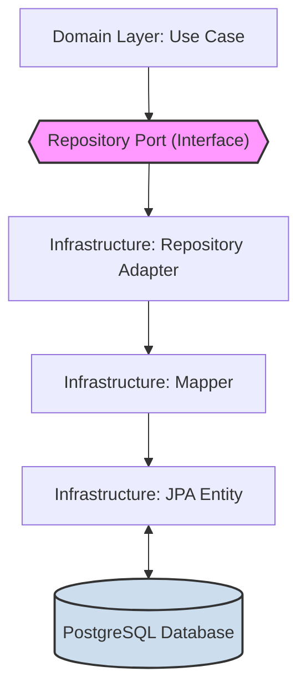

# **Implementation Details**

This document provides a detailed overview of the project's architecture, design patterns, and the implementation of its
core features.

### Table of Contents

1. [Core Architectural Principles](#1-core-architectural-principles)
2. [Configuration Strategy](#2-configuration-strategy)
3. [Feature: OTP Management](#3-feature-otp-management)
    - [OTP Generation](#otp-generation)
    - [OTP Hashing](#otp-hashing)
    - [OTP Storage and Repository](#otp-storage-and-repository)
    - [OTP Configuration](#otp-configuration)
    - [Serialization and System Beans](#serialization-and-system-beans)
4. [Feature: Asynchronous Notifications (RabbitMQ)](#4-feature-asynchronous-notifications-rabbitmq)
    - [The Flow of a Notification](#the-flow-of-a-notification)
    - [AMQP Configuration and Serialization](#amqp-configuration-and-serialization)
5. [Feature: Passkey Management and Authentication (WebAuthn)](#5-feature-passkey-management-and-authentication-webauthn)
    - [Challenge Generation and Caching](#challenge-generation-and-caching)
    - [Passkey Options Generation](#passkey-options-generation)
   - [Passkey Verification](#passkey-verification)
    - [User and Passkey Persistence](#user-and-passkey-persistence)

---

### 1. Core Architectural Principles

The application is built following the **Hexagonal Architecture (Ports and Adapters)** pattern.

- **Core (Domain/Application Layers)**: Contains the pure business logic and rules. It has no knowledge of external
  technologies like databases or message queues.
- **Ports**: Interfaces defined within the core that dictate how the core interacts with the outside world.
- **Adapters**: Concrete implementations of the ports that "adapt" a specific technology to the needs of the core.

A key principle we enforce is the **strict separation of Domain and Persistence models**. The domain models (e.g.,
`Passkey`) are pure Java objects that represent business concepts. The persistence models (e.g., `JpaPasskey`) are
JPA-annotated entities that represent the database schema. This separation is enforced by dedicated **Mapper** classes.



This ensures the business logic remains entirely independent of the database schema, allowing either to evolve without
breaking the other.

---

### 2. Configuration Strategy

Configuration is managed centrally in `application.yaml` and loaded into the application in a type-safe manner.

- **`application.yaml`**: The single source of truth for all environment-specific settings. It is organized using
  prefixes like `spring.*` for framework settings and `app.*` for custom application settings.
- **`@ConfigurationProperties`**: We use this annotation with Java `record` types (e.g., `OtpProperties`) to create
  immutable, type-safe configuration objects. This prevents configuration-related errors at runtime and makes the
  configuration easy to reason about.

---

### 3. Feature: OTP Management

This section outlines the technical design for generating, securing, and storing One-Time Passwords (OTPs).

#### OTP Generation

- **`SecureOtpNumberGenerator.java`**
    - **Purpose**: The concrete implementation of the `OtpGenerationPort`. This adapter is responsible for creating a
      cryptographically secure, numeric OTP of a configured length.
    - **Mechanism**: It leverages `java.security.SecureRandom` to ensure a high degree of randomness, which is critical
      for security. To guarantee the OTP has the correct number of digits (e.g., exactly 6 digits, not a number less
      than 100,000), it calculates a numerical range (a lower and upper bound) and generates a random number within that
      specific range. It also includes validation to prevent requests for excessively long or invalid OTP lengths.

#### OTP Hashing

- **`BCryptHashingService.java`**
    - **Purpose**: The concrete implementation of the `HashingPort`. This adapter's role is to provide a secure, one-way
      hashing function for the raw OTP and a method to verify a raw OTP against its stored hash.
    - **Mechanism**: This component acts as an adapter over the robust Spring Security crypto module. It delegates the
      `hashSecurely` and `verify` operations directly to the configured `PasswordEncoder` bean (which uses BCrypt by
      default). This approach allows us to rely on a standard, battle-tested security library without embedding hashing
      logic directly into our domain.

#### OTP Storage and Repository

- **`RedisOtpRepository.java`**
    - **Purpose**: The concrete implementation of the `OtpRepository` port, responsible for all interactions with the
      Redis datastore.
    - **Mechanism**: It leverages `RedisTemplate<String, Otp>` to serialize the `Otp` object into JSON for storage.
      During the `save` operation, it applies the configured TTL (Time-To-Live) to the Redis key. The sole purpose of
      this TTL is to act as an automatic **housekeeping** mechanism. It instructs Redis to autonomously delete the key
      after the duration has passed, ensuring the datastore remains clean of stale OTPs.

#### OTP Configuration

- **`OtpConfiguration.java`**
    - **Purpose**: Acts as an adapter that implements the `OtpConfigPort` interface.
    - **Mechanism**: It sources configuration from the type-safe `OtpProperties` record (which is loaded from
      `application.yaml`). This decouples the domain and other adapters from the specific configuration mechanism,
      making them dependent on an abstraction (`OtpConfigPort`) rather than a concrete detail. It also injects the
      `Clock` bean to provide a consistent source of time.

#### Serialization and System Beans

- **`JSONConfiguration.java` & `OtpMixin`**
    - **Purpose**: Configure object-to-JSON serialization for Redis.
    - **Mechanism**: The `JSONConfiguration` provides a shared `ObjectMapper` bean, which is used by Spring Data Redis
      to convert `Otp` objects into JSON strings. The `OtpMixin` is necessary to instruct Jackson on how to deserialize
      the JSON back into an immutable `Otp` object, which may lack a default constructor.
- **`ClockConfiguration.java`**
    - **Purpose**: Provides a `Clock` bean for consistent time-handling.
    - **Why it's important**: Injecting a `Clock` instead of calling `Instant.now()` directly is a critical practice for
      **testability**. In tests, we can replace the system clock with a fixed clock (`Clock.fixed(...)`) to test
      time-sensitive logic (like OTP expiration) deterministically and instantly, without introducing `Thread.sleep()`.

---

### 4. Feature: Asynchronous Notifications (RabbitMQ)

To ensure the application remains responsive and resilient, notifications (such as sending an OTP via email) are handled
asynchronously using a message broker. We use RabbitMQ for this purpose, which decouples the core application from the
actual notification delivery system.

This design provides several key benefits:

- **Responsiveness**: The user-facing API call (e.g., "request OTP") can return immediately after publishing a message,
  without waiting for the email to be sent.
- **Resilience**: If the downstream notification service is temporarily unavailable, messages are safely queued in
  RabbitMQ and will be processed once the service recovers.
- **Scalability**: The service that consumes these notification commands can be scaled independently of the main
  application.

#### The Flow of a Notification

The implementation follows the Hexagonal Architecture pattern, where the application core communicates through a port,
which is implemented by an adapter that handles the specifics of RabbitMQ.

1. **The Port (`NotificationPort.java`)**
    - **Role**: An "Outgoing Port" defined within the application's core logic.
    - **Purpose**: To provide a simple, technology-agnostic contract for sending notifications. The use case layer
      depends only on this interface and has no knowledge of RabbitMQ or message queues.
      ```java
      public interface NotificationPort {
          void sendOtpToUserEmail(@NonNull EmailAddress userEmail, @NonNull String otpValue);
      }
      ```

2. **The Primary Adapter (`NotificationAdapter.java`)**
    - **Role**: The main driven adapter that implements the `NotificationPort`, located in the
      `infrastructure.driven.notification` package.
    - **Purpose**: To bridge the gap between the business request (e.g., "send this OTP to this user") and the messaging
      infrastructure.
    - **Mechanism**: It takes the domain-level inputs, uses the `NotificationTemplateProvider` to construct the email
      body, and then assembles a `SendEmailNotificationCommand`. Finally, it delegates the actual act of publishing this
      command to the `NotificationCommandPublisher`. This keeps the adapter focused on orchestration rather than
      low-level broker interaction.

3. **The Message Publisher (`NotificationCommandPublisherAmqp.java`)**
    - **Role**: The infrastructure-specific driven adapter that communicates directly with RabbitMQ.
    - **Purpose**: Implements the `NotificationCommandPublisher` interface, abstracting away the details of the
      `RabbitTemplate`.
    - **Mechanism**: It uses Spring AMQP's `RabbitTemplate` to send the `SendEmailNotificationCommand` object to a
      specific exchange and routing key. These values are externalized in `application.yaml` and injected via `@Value`
      annotations, making the component configurable without code changes.

4. **The Command Message (`SendEmailNotificationCommand.java`)**
    - **Role**: The Data Transfer Object (DTO), representing the message contract.
    - **Purpose**: An immutable `record` that defines the precise structure of the message being sent to the RabbitMQ
      queue. This creates a clear, explicit contract between the publisher (this application) and any consumer service
      that will process the notification.
      ```java
      public record SendEmailNotificationCommand(
              String recipientEmail,
              String subject,
              String htmlBody
      ) {}
      ```

#### AMQP Configuration and Serialization

- **`AmqpConfiguration.java`**
    - **Purpose**: Configures the necessary Spring AMQP beans to enable communication with RabbitMQ.
    - **Key Beans**:
        - `TopicExchange`: Declares the RabbitMQ exchange where notification commands will be published. Using a topic
          exchange provides flexible routing capabilities for future needs.
        - `MessageConverter`: This bean is configured to use a `Jackson2JsonMessageConverter`. This is crucial because
          it automatically serializes the `SendEmailNotificationCommand` object into a **JSON string** before sending it
          to RabbitMQ. This makes messages language-agnostic and easily consumable by other microservices.

- **`application.yaml`**
    - **Purpose**: Externalizes all connection details and routing information for RabbitMQ, allowing the application to
      be deployed and reconfigured across different environments (dev, staging, prod) seamlessly.
  ```yaml
  app:
    amqp:
      publisher:
        notifications:
          otp:
            exchange: notifications.commands.v1.exchange
            routing-key: send.otp.email
  ```

---

### 5. Feature: Passkey Management and Authentication (WebAuthn)

This section details the full lifecycle of a FIDO2/WebAuthn (Passkey) ceremony, from the initial challenge generation
and caching to the long-term persistence of user credentials.

#### Challenge Generation and Caching

The WebAuthn ceremony is inherently stateful. The server must generate a unique challenge, send it to the client, and
then retrieve that challenge's context to verify the client's response. To manage this state, we use a `Session` object
which is temporarily stored in Redis. The `Session` acts as a container for the challenge and other ceremony-related
data.

- **The `Session` Domain Object**: This `record` is the central object for tracking an in-progress WebAuthn ceremony. It
  contains a `sessionId` (the cache key), the `challenge` object (with its payload and expiration), and optional context
  like the `userId`.

- **Generation Process**:
    1. **Session ID Generation (`SessionIdGenerator.java`)**: A dedicated adapter that implements
       `SessionIdGenerationPort`. It creates a **UUIDv7** to serve as the `sessionId`. This time-ordered UUID is chosen
       for its high performance in indexed database lookups, making the design future-proof.
    2. **Challenge Generation (`SecureRandomChallengeGenerator.java`)**: This adapter implements
       `ChallengeGenerationPort` and creates the `Challenge` value object. It generates the cryptographically secure
       nonce required by the WebAuthn standard and calculates its expiration time.
    3. **Session Assembly**: The use case layer combines the `sessionId` and `challenge` into a `Session` object.

- **Caching (`RedisSessionRepository.java`)**:
    - This adapter implements the `SessionRepository` port and is responsible for caching the entire `Session` object in
      Redis.
    - The `sessionId` is used as the key.
    - The adapter calculates the *exact* remaining lifetime from the `challenge`'s expiration time and sets it as the
      TTL on the Redis key. This delegates all cleanup responsibility to Redis, ensuring no stale sessions are left
      behind.

#### Passkey Options Generation

- **Purpose**: This adapter implements the `CredentialOptionsPort`. It is designed as a **facade** that delegates the
  complex construction logic for WebAuthn options to specialized **assembler** classes.

- **Mechanism**:
    * **The Facade (`CredentialOptionsService`):**
        * A lightweight Spring `@Service` that is injected with `CredentialOptionsProperties` and the system `Clock`.
        * Its sole responsibility is to instantiate the appropriate assembler (`PasskeyCreationOptionsAssembler` or
          `PasskeyRequestOptionsAssembler`) and pass the necessary data to it. This keeps the service clean and focused
          on orchestration.

    * **The Assemblers (`Passkey...Assembler` classes):**
        * These are plain Java classes (not Spring components) that contain the detailed, low-level logic for building
          the WebAuthn options objects. This separation of concerns makes the construction logic easier to test and
          maintain.

    * **Key Implementation Details (within Assemblers):**
        * **Type-Safe Configuration**: The facade passes the `@ConfigurationProperties` record down to the assemblers,
          which use it to get the Relying Party ID (`rpId`) and `authMode`.
        * **Registration Options**: The `PasskeyCreationOptionsAssembler` constructs the
          `PublicKeyCredentialCreationOptions` object. It populates it with Relying Party info, user details (including
          the `userHandle`), the challenge, and a strict `AuthenticatorSelectionCriteria` that requires user
          verification (e.g., biometrics/PIN).
        * **Authentication Options**: The `PasskeyRequestOptionsAssembler` constructs the
          `PublicKeyCredentialRequestOptions`. It includes the challenge and, crucially, the `allowCredentials` list
          derived from the user's existing passkeys. This list hints to the browser which credentials are valid for this
          login attempt.
        * **Dynamic Timeout**: A key feature across both assemblers is the **dynamic timeout calculation**. The timeout
          for the ceremony is calculated based on the challenge's remaining lifetime (
          `Duration.between(now, challenge.expirationTime())`). This ensures the options sent to the client are always
          synchronized with the server's state.

#### Passkey Verification

This section covers the verification process for both passkey registration and authentication responses. The
verification system acts as a bridge between the WebAuthn protocol and our domain models, ensuring cryptographic
validity while handling the conversion between different data representations.

- **Purpose**: The verification layer implements the `PasskeyVerificationPort` and serves as the main orchestrator for
  validating WebAuthn responses during both registration and authentication ceremonies.

- **Main Service (`PasskeyVerificationService.java`)**:
    - **Role**: Acts as a **facade** that coordinates the verification process by delegating to specialized handlers for
      registration and authentication.
    - **Mechanism**: This service maintains a clean separation of concerns by routing requests to either
      `PasskeyRegistrationHandler` or `PasskeyAuthenticationHandler` based on the operation type. It also handles the
      translation of WebAuthn4J-specific exceptions into domain-specific exceptions that the application layer can
      understand.
    - **Exception Handling**: Catches low-level `WebAuthnException` and `MaliciousCounterValueException` from the
      WebAuthn4J library and translates them into meaningful domain exceptions like
      `RegistrationConfirmAttemptException` and `MaliciousCounterException`.

- **Registration Verification (`PasskeyRegistrationHandler.java`)**:
    - **Purpose**: Handles the verification of passkey registration responses and converts the verified data into domain
      models.
    - **Mechanism**:
        - Injects `WebAuthnRegistrationManager` bean configured in `WebAuthn4jConfig.java`. The current configuration
          uses the non-strict manager for flexible validation suitable for development and testing environments.
        - Leverages `RegistrationParametersProvider` to construct the verification parameters from session data and
          configuration.
        - Delegates the final conversion from WebAuthn4J's `RegistrationData` to our domain `Passkey` object to
          `RegistrationDataMapper`.
        - Ensures the session contains valid user context before proceeding with registration.

- **Authentication Verification (`PasskeyAuthenticationHandler.java`)**:
    - **Purpose**: Validates authentication responses and updates the passkey's security state (specifically the sign
      count).
    - **Mechanism**:
        - Injects `WebAuthnAuthenticationManager` bean configured in `WebAuthn4jConfig.java` for standard WebAuthn
          authentication verification.
        - Relies on `AuthenticationParametersProvider` to build verification parameters from session data, passkey
          information, and configuration.
        - **Sign Count Update**: Automatically extracts and updates the passkey's sign count from the authentication
          response. This is critical for detecting cloned credentials, as each authentic authenticator increments this
          counter with every use.

- **Parameter Providers**:
    - **`RegistrationParametersProvider.java`**: Constructs `RegistrationParameters` for registration verification by
      combining session challenge data with passkey configuration. It uses the challenge from session data and applies
      configuration settings for user verification and presence requirements.
    - **`AuthenticationParametersProvider.java`**: Builds `AuthenticationParameters` for authentication verification by
      combining session data, passkey information, and configuration. It includes credential allowlists from session
      data to ensure only valid credentials are accepted for the authentication attempt.

- **WebAuthn4J Configuration (`WebAuthn4jConfig.java`)**:
    - **Purpose**: Provides centralized configuration for WebAuthn4J library components as Spring beans.
    - **Key Beans**:
        - `WebAuthnRegistrationManager`: Currently configured as a non-strict manager using
          `createNonStrictWebAuthnRegistrationManager()` for flexible validation during development. This can be
          replaced with stricter configuration for production environments.
        - `WebAuthnAuthenticationManager`: Standard authentication manager for verifying authentication assertions.
        - `ObjectConverter`: Provides JSON and CBOR converters required by WebAuthn4J for data serialization.
    - **Benefits**: Proper dependency injection allows for easier testing, configuration management, and potential
      runtime switching between strict and non-strict validation modes.

- **Data Mapping and Conversion**:
    - **`RegistrationDataMapper.java`**: Converts WebAuthn4J's `RegistrationData` into our domain `Passkey` model. This
      mapper extracts essential fields like credential ID, public key, sign count, and security flags while preserving
      attestation data for audit purposes. It also handles the conversion of transport information and extensions from
      WebAuthn format to our domain enums.
    - **`WebAuthnMapper.java`**: Provides utility methods for converting between domain models and WebAuthn4J
      representations. It handles complex conversions like transforming extension maps and transport enums, and provides
      converters for attestation objects and client data.
    - **`PasskeyToCredentialRecordMapper.java`**: Converts domain `Passkey` objects back into WebAuthn4J's
      `CredentialRecord` format for authentication verification. This reverse mapping is essential for the verification
      process, as it reconstructs the credential information needed by the WebAuthn4J library.

#### User and Passkey Persistence

We use PostgreSQL as our primary data store for persistent entities like users and passkeys, managed via Spring Data
JPA. The implementation follows our core architectural principles, with a clear separation between domain models,
persistence entities, and mappers.

- **User Persistence (`JpaUser.java`)**: A simple JPA entity representing a user in the `users` table. It stores the
  user's `id`, unique `email`, and an `enabled` flag.

- **Passkey Persistence (`JpaPasskey.java`)**: This is the core persistence entity representing a registered passkey in
  the `passkey` table.
    - **Core Authentication Fields**: Includes `id`, `userHandle`, `publicKey`, and `signCount`. The `signCount` is
      critical for preventing credential cloning attacks.
    - **Auditing Data**: The raw `attestationObject` and `attestationClientDataJSON` are stored but marked as
      `FetchType.LAZY`. This is a crucial performance optimization, as these potentially large fields are only needed
      for occasional audits, not regular authentications.

- **Repository Adapter (`PostgresPasskeyRepository.java`)**: Implements the `PasskeyRepository` port.
    - Uses the `JpaToEntityPasskeyMapper` to convert database entities into domain models.
    - Provides an efficient `updateSignCount` method that leverages a custom `@Query`, which is a significant
      performance gain during authentication.

- **Mapper (`JpaToEntityPasskeyMapper.java`)**: This mapper is central to our decoupling strategy.
    - It provides a `toDomainPasskey(JpaPasskey)` method to map the rich JPA entity to the leaner `Passkey` domain
      model.
    - It intentionally **lacks** a full `toJpaPasskey(Passkey)` method. This is because the `Passkey` domain model does
      not contain all the required data (like attestation data) to construct a new, valid persistence entity. This
      design choice prevents incomplete or invalid data from being persisted.
