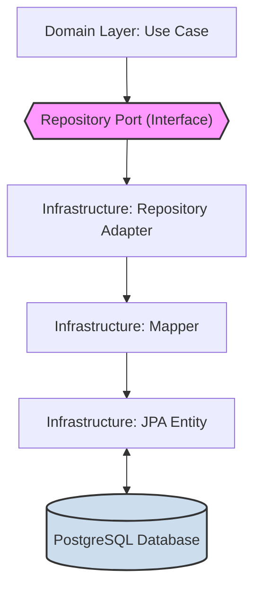

# **Implementation Details**

This document provides a detailed overview of the project's architecture, design patterns, and the implementation of its
core features.

### Table of Contents

1. [Core Architectural Principles](#1-core-architectural-principles)
2. [Configuration Strategy](#2-configuration-strategy)
3. [Feature: OTP Management](#3-feature-otp-management)
    - [OTP Security Flow](#otp-security-flow)
    - [OTP Storage](#otp-storage)
    - [Configuration & Supporting Components](#configuration--supporting-components)
4. [Feature: Asynchronous Notifications (RabbitMQ)](#4-feature-asynchronous-notifications-rabbitmq)
    - [The Notification Flow](#the-notification-flow)
    - [AMQP Configuration](#amqp-configuration)
    - [Package Organization](#package-organization)
5. [Feature: Token Issuing and Management](#5-feature-token-issuing-and-management)
    - [Token Issuing Stub Implementation](#token-issuing-stub-implementation)
   - [Integration Points](#integration-points)
   - [Testing](#testing)
6. [Feature: Passkey Management and Authentication (WebAuthn)](#6-feature-passkey-management-and-authentication-webauthn)
    - [Challenge Generation and Caching](#challenge-generation-and-caching)
    - [Passkey Options Generation](#passkey-options-generation)
   - [Passkey Verification](#passkey-verification)
    - [User and Passkey Persistence](#user-and-passkey-persistence)
7. [Feature: Logging and Observability](#7-feature-logging-and-observability)
    - [Correlation ID Tracking](#correlation-id-tracking)
    - [Structured Logging](#structured-logging)
    - [Monitoring with Spring Boot Actuator](#monitoring-with-spring-boot-actuator)
8. [Shared Infrastructure Package Structure](#shared-infrastructure-package-structure)
---

### 1. Core Architectural Principles

The application follows **Hexagonal Architecture (Ports and Adapters)**:

- **Core (Domain/Application)**: Pure business logic with no knowledge of external technologies (databases, message
  queues)
- **Ports**: Interfaces defining how the core interacts with the outside world
- **Adapters**: Concrete implementations that connect specific technologies to the core

**Key Principle: Domain/Persistence Separation**

We strictly separate domain models from persistence models:

- **Domain models** (e.g., `Passkey`) are pure Java objects representing business concepts
- **Persistence models** (e.g., `JpaPasskey`) are JPA entities representing database schemas
- **Mappers** enforce this separation by translating between the two



**Why this matters**: Business logic stays independent of database implementation. Either can evolve without breaking
the other.

---

### 2. Configuration Strategy

All configuration is centralized in `application.yaml` and loaded type-safely:

- **`application.yaml`**: Single source of truth for environment-specific settings
    - Framework settings: `spring.*` prefix
    - Custom application settings: `app.*` prefix
- **`@ConfigurationProperties`**: Used with Java `record` types (e.g., `OtpProperties`) to create immutable, type-safe
  configuration objects

**Why this matters**: Prevents configuration errors at runtime and makes settings easy to validate. Spring Boot 3.5's
`@ConfigurationProperties` binds YAML directly to records without needing setters.

#### OAuth2 Authorization Server Integration

//placeholder, will get it after finishing impl of OAuth auth server

---

### 3. Feature: OTP Management

OTPs are generated, hashed, and temporarily stored with automatic expiration.

---

#### OTP Security Flow

**Generation** (`SecureOtpNumberGenerator`)

- Uses `java.security.SecureRandom` for cryptographically secure randomness
- Generates OTPs within a precise numerical range (e.g., 100000-999999 for 6-digit codes)
- Validates length requests to prevent invalid configurations

**Why SecureRandom**: Standard `Random` is predictable and unsafe for security-critical tokens.

**Hashing** (`BCryptHashingService`)

- Adapts Spring Security's `PasswordEncoder` (BCrypt by default)
- Provides `hashSecurely()` and `verify()` operations
- Never stores raw OTPs—only their hashes

**Why BCrypt**: Industry-standard, adaptive hashing algorithm resistant to brute-force attacks. By delegating to Spring
Security, we avoid implementing cryptography ourselves.

---

#### OTP Storage

**Redis Repository** (`RedisOtpRepository`)

- Stores `Otp` objects as JSON using `RedisTemplate`
- Applies TTL (Time-To-Live) during save operations
- Redis automatically deletes expired keys—no manual cleanup needed

**Why Redis**: In-memory storage provides fast lookups for short-lived data. TTL acts as automatic housekeeping.

---

#### Configuration & Supporting Components

**`OtpConfiguration`**: Implements `OtpConfigPort` by loading settings from `OtpProperties` (from `application.yaml`).
Decouples domain from configuration details.

**`JSONConfiguration` & `OtpMixin`**: Configure Jackson `ObjectMapper` for Redis serialization. The mixin handles
deserialization of immutable `Otp` records.

**`ClockConfiguration`**: Provides a `Clock` bean instead of calling `Instant.now()` directly.

**Why inject Clock**: Critical for testability. Tests can use `Clock.fixed(...)` to deterministically test
time-sensitive logic (OTP expiration) without `Thread.sleep()`.

---

### 4. Feature: Asynchronous Notifications (RabbitMQ)

Notifications (e.g., sending OTP emails) are handled asynchronously via RabbitMQ to keep the application responsive and
resilient.

**Key Benefits**:

- **Responsiveness**: API calls return immediately without waiting for email delivery
- **Resilience**: Messages queue safely if the notification service is down, processing when it recovers
- **Scalability**: Notification consumers can scale independently from the main application

---

#### The Notification Flow

The implementation follows Hexagonal Architecture with layered abstraction:

**1. Port Interface** (`NotificationPort`)

```java
public interface NotificationPort {
    void sendOtpToUserEmail(@NonNull EmailAddress userEmail, @NonNull String otpValue);
}
```

- Technology-agnostic contract for sending notifications
- Use cases depend only on this interface—no knowledge of RabbitMQ

**2. Primary Adapter** (`NotificationAdapter`)

- Implements `NotificationPort` to bridge business logic and messaging infrastructure
- Uses `NotificationTemplateProvider` to construct email body
- Assembles `SendEmailNotificationCommand` and delegates to publisher
- Focuses on orchestration, not low-level broker details

**3. Message Publisher** (`NotificationCommandPublisherAmqp`)

- Infrastructure adapter that communicates directly with RabbitMQ
- Uses Spring AMQP's `RabbitTemplate` to send commands
- Exchange and routing key are externalized in `application.yaml` for environment flexibility

**4. Command Message** (`SendEmailNotificationCommand`)

```java
public record SendEmailNotificationCommand(
        String recipientEmail,
        String subject,
        String htmlBody
) {
}
```

- Immutable DTO defining the message contract
- Creates explicit contract between publisher and consumer services

---

#### AMQP Configuration

**`AmqpConfiguration.java`** provides Spring AMQP beans:

- **`TopicExchange`**: Declares the RabbitMQ exchange for notification commands (topic exchange allows flexible future
  routing)
- **`MessageConverter`**: Uses `Jackson2JsonMessageConverter` to automatically serialize commands to JSON—making
  messages language-agnostic

**`application.yaml`** externalizes connection and routing details:

```yaml
app:
  amqp:
    publisher:
      notifications:
        otp:
          exchange: notifications.commands.v1.exchange
          routing-key: send.otp.email
```

**Why externalize**: Enables environment-specific configuration (dev/staging/prod) without code changes.

---

#### Package Organization

Notification infrastructure follows a modular structure:

- **`out/amqp/`**: AMQP-specific publishers
- **`config/`**: Configuration properties
- **`dto/`**: Data transfer objects
- **`exception/`**: Notification-specific exceptions

This separation keeps related concerns grouped and makes navigation easier.

---

### 5. Feature: Token Issuing and Management

After successful authentication or registration, users receive JWT tokens for subsequent API calls.

---

#### Token Issuing Stub Implementation

**`TokenIssuingStub.java`** (`infrastructure.driven.tokens`)

- **Current Status**: Temporary placeholder implementation marked `@Deprecated`
- **Purpose**: Allows authentication flows to complete during development without a full token system
- **Behavior**: Returns hardcoded values (`"accessToken"` and `"refreshToken"`) wrapped in an `AuthTokens` record

⚠️ **Development Only**: This stub provides no actual security and must not be deployed to production.

---

#### Integration Points

**Port Interface** (`TokenIssuingPort`)

```java
AuthTokens issueTokensForUser(UUID userId);
```

- Defines the contract for token issuance
- Returns `AuthTokens` record containing access and refresh tokens

**Use Case Integration**

- `CompleteRegistrationUseCase` and `CompleteAuthenticationUseCase` depend on this port
- Issues tokens after successful verification ceremonies

**Future Implementation**: Will integrate with Spring OAuth2 Authorization Server for production-grade token
management (JWT signing, refresh token rotation, token introspection).

---

#### Testing

**`TokenIssuingStubTest.java`** validates that the stub returns non-null tokens, ensuring the interface contract is
fulfilled even with the placeholder implementation.

---

### 6. Feature: Passkey Management and Authentication (WebAuthn)

This section covers the full lifecycle of FIDO2/WebAuthn (Passkey) ceremonies, from challenge generation to credential
persistence.

---

#### Challenge Generation and Caching

WebAuthn ceremonies are stateful: the server generates a challenge, sends it to the client, then retrieves it to verify
the response. We use a `Session` object temporarily stored in Redis to manage this state.

**The `Session` Domain Object**: A `record` tracking an in-progress ceremony, containing:

- `sessionId` (cache key)
- `challenge` (cryptographic nonce with expiration)
- Optional context (e.g., `userId`)

**Generation Flow**:

1. **Session ID** (`SessionIdGenerator`): Generates UUIDv7 for the `sessionId`
    - **Why UUIDv7**: Time-ordered UUIDs provide high performance in indexed lookups (future-proof design)

2. **Challenge** (`SecureRandomChallengeGenerator`): Creates the cryptographically secure nonce required by WebAuthn and
   calculates expiration time

3. **Session Assembly**: Use case combines `sessionId` and `challenge` into a `Session` object

**Caching** (`RedisSessionRepository`):

- Stores `Session` in Redis using `sessionId` as the key
- Calculates exact TTL from challenge expiration and sets it on the Redis key
- Redis handles automatic cleanup—no stale sessions left behind

---

#### Passkey Options Generation

**`CredentialOptionsService`** implements `CredentialOptionsPort` as a facade that delegates to specialized assemblers.

**Mechanism**:

- **Facade Pattern**: Lightweight service injected with `CredentialOptionsProperties` and `Clock`
- **Assemblers** (`PasskeyCreationOptionsAssembler` and `PasskeyRequestOptionsAssembler`): Plain Java classes containing
  the detailed WebAuthn options construction logic

**Key Features**:

- **Registration Options**: Constructs `PublicKeyCredentialCreationOptions` with Relying Party info, user details (
  including `userHandle`), challenge, and strict `AuthenticatorSelectionCriteria` requiring user verification (
  biometrics/PIN)
- **Authentication Options**: Builds `PublicKeyCredentialRequestOptions` with challenge and `allowCredentials` list (
  hints browser which credentials are valid)
- **Dynamic Timeout**: Calculates ceremony timeout from challenge's remaining lifetime (
  `Duration.between(now, challenge.expirationTime())`), ensuring options stay synchronized with server state

---

#### Passkey Verification

**`PasskeyVerificationService`** implements `PasskeyVerificationPort` and coordinates verification by delegating to
specialized handlers.

**Components**:

- **Facade**: Routes requests to `PasskeyRegistrationHandler` or `PasskeyAuthenticationHandler`
- **Exception Translation**: Converts WebAuthn4J exceptions (`WebAuthnException`, `MaliciousCounterValueException`) into
  domain exceptions

**Registration Handler** (`PasskeyRegistrationHandler`):

- Uses `WebAuthnRegistrationManager` (configured in `WebAuthn4jConfig` as non-strict for development)
- Leverages `RegistrationParametersProvider` to build verification parameters
- Delegates conversion from WebAuthn4J's `RegistrationData` to domain `Passkey` via `RegistrationDataMapper`

**Authentication Handler** (`PasskeyAuthenticationHandler`):

- Uses `WebAuthnAuthenticationManager` for standard verification
- Relies on `AuthenticationParametersProvider` for parameter construction
- **Sign Count Update**: Extracts and updates passkey's sign count from the response
    - **Why this matters**: Sign count prevents credential cloning—each authentic authenticator increments this counter
      with every use

**Data Mapping**:

- **`RegistrationDataMapper`**: Converts `RegistrationData` → domain `Passkey` (extracts credential ID, public key, sign
  count, security flags)
- **`WebAuthnMapper`**: Utility methods for converting between domain models and WebAuthn4J representations
- **`PasskeyToCredentialRecordMapper`**: Converts domain `Passkey` → `CredentialRecord` for authentication verification

**WebAuthn4J Configuration** (`WebAuthn4jConfig`):

- Provides `WebAuthnRegistrationManager` (non-strict mode for development)
- Provides `WebAuthnAuthenticationManager` (standard verification)
- Provides `ObjectConverter` for JSON/CBOR serialization

---

#### User and Passkey Persistence

Uses PostgreSQL via Spring Data JPA with strict domain/persistence separation.

**Entities**:

- **`JpaUser`**: Stores `id`, `email`, and `enabled` flag in `users` table
- **`JpaPasskey`**: Stores passkey in `passkey` table with:
    - Core fields: `id`, `userHandle`, `publicKey`, `signCount`
    - Audit data: `attestationObject` and `attestationClientDataJSON` marked `FetchType.LAZY`
        - **Why lazy**: Large attestation fields only needed for audits, not regular authentication (performance
          optimization)

**Repository Adapter** (`PostgresPasskeyRepository`):

- Implements `PasskeyRepository` port
- Uses `JpaToEntityPasskeyMapper` to convert entities → domain models
- Provides efficient `updateSignCount` method with custom `@Query` (performance gain during authentication)

**Mapper** (`JpaToEntityPasskeyMapper`):

- Provides `toDomainPasskey(JpaPasskey)` for entity → domain conversion
- Intentionally lacks full `toJpaPasskey(Passkey)` method
    - **Why**: Domain `Passkey` doesn't contain all required data (e.g., attestation) to construct valid persistence
      entities—prevents incomplete/invalid data from being persisted

---

### 7. Feature: Logging and Observability

The application implements comprehensive logging and observability to ensure traceability, debugging, and monitoring
across all authentication flows.

---

#### Correlation ID Tracking

**`CorrelationIdFilter`** (`infrastructure.driving.rest.shared.config.filters`)

- Servlet filter ensuring every HTTP request has a unique correlation ID for distributed tracing
- Checks for existing `X-Correlation-ID` header; generates UUID if absent
- Stores ID in MDC (Mapped Diagnostic Context) for automatic inclusion in all log statements
- Adds correlation ID to response headers for client-side tracing

**Benefits**:

- **Request Tracking**: Follow a single request through all log statements across services
- **Debugging**: Quickly isolate logs for problematic requests
- **Distributed Tracing**: IDs can propagate to downstream services (e.g., notification service)

**Example Log Output**:

```json
{
  "timestamp": "2025-10-06T12:34:56.789Z",
  "level": "INFO",
  "correlationId": "018c3e5f-1234-7890-abcd-ef1234567890",
  "message": "User verification initiated",
  "email": "u***@example.com"
}
```

---

#### Structured Logging

All layers use structured logging with proper context:

**Key Features**:

- **Contextual Information**: Every log includes relevant domain context (email, session ID, operation type)
- **Proper Log Levels**: DEBUG (technical details), INFO (business operations), WARN (recoverable issues), ERROR (
  failures with stack traces)
- **PII Protection**: Email addresses automatically masked via `LoggingUtils.maskEmail()` (e.g., `user@example.com` →
  `u***@example.com`)

**Logging Strategy by Layer**:

- **Use Cases** (`application.*`): INFO level for business operations ("Verification initiated")
- **Adapters** (`infrastructure.driven.*`): DEBUG level for technical operations ("Generating OTP", "Hashing with
  BCrypt")
- **Controllers** (`infrastructure.driving.*`): INFO level for request/response tracking
- **Exceptions**: ERROR level with full stack traces

---

#### Monitoring with Spring Boot Actuator

Spring Boot Actuator provides production-ready monitoring:

- **Health Checks**: `/actuator/health` for liveness/readiness probes
- **Metrics**: JVM, HTTP, and custom application metrics (integrates with Prometheus/Grafana)
- **Docker Integration**: Health checks in `compose.yml` ensure services wait for dependencies (PostgreSQL, Redis,
  RabbitMQ)

⚠️ **Security Note**: In production, secure actuator endpoints (authentication, IP whitelisting) and expose only
necessary endpoints via `management.endpoints.web.exposure.include`.

---

### Shared Infrastructure Package Structure

The `infrastructure.driving.rest.shared` package is organized for clarity and separation of concerns:

```
infrastructure.driving.rest.shared/
├── config/
│   ├── filters/
│   │   └── CorrelationIdFilter.java             # Request correlation tracking
│   └── serializers/
│       ├── UserVerificationRequirementSerializer.java    # WebAuthn enum serializer
│       └── UserVerificationRequirementDeserializer.java  # WebAuthn enum deserializer
├── dto/
│   └── AuthenticationGrantResponse.java         # Common response DTO
└── exception/
└── handler/
├── GlobalExceptionHandler.java          # Centralized exception handling
└── ApiError.java                        # Standardized error response
```

**Key Organization**:

- **`config/filters/`**: Servlet filters (correlation ID tracking)
- **`config/serializers/`**: Custom Jackson serializers/deserializers for WebAuthn types
- **`dto/`**: Shared data transfer objects
- **`exception/handler/`**: Centralized exception handling with `GlobalExceptionHandler` providing consistent API error
  responses (includes correlation ID) via `ApiError` format